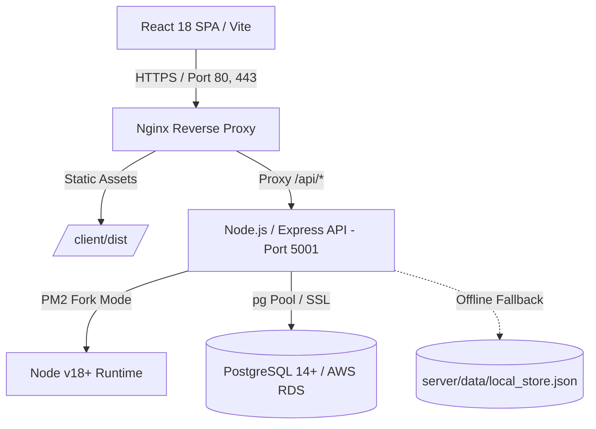

# 📦 YogaBar Packaging Development Tracker

> **Enterprise Packaging Operations, Workflow Governance & Specification Management System**  
> Built for Regular & Growth Packaging Verticals to manage new product development, technical specifications, artwork lifecycles, converter coordination, and stage-gate approvals from Brief to Market Launch.

---

## 📑 Table of Contents
1. [Platform Overview](#-platform-overview)
2. [Key Features](#-key-features)
3. [Architecture & Technology Stack](#-architecture--technology-stack)
4. [Project Structure](#-project-structure)
5. [Database Architecture & Migrations](#-database-architecture--migrations)
6. [User Roles & Default Credentials](#-user-roles--default-credentials)
7. [Local Development Setup](#-local-development-setup)
8. [AWS EC2 & Production Deployment](#-aws-ec2--production-deployment)
9. [Debugging & Environment Switching (Live)](#-debugging--environment-switching-live)
10. [API Reference](#-api-reference)
11. [Security & Compliance](#-security--compliance)

---

## 🌟 Platform Overview

The **Packaging Development Tracker** is an end-to-end digital lifecycle governance platform tailored for FMCG packaging development. It eliminates fragmented spreadsheets, emails, and offline trackers by centralizing:
- **Project Timelines & Stage Gates**: Tracking deadlines, lead times, and real-time status across 10 defined stages.
- **Specification Library & Packaging Formats**: Standardized dimensions, laminate barrier layers, substrate weights, and structural templates.
- **Multi-Variant Artwork Management**: Image-only proof approvals, sub-variant tracking, thumbnail previews, and fullscreen lightbox inspections.
- **Governance & Audit Trail**: Granular role-based permissions, automated risk scoring, and tamper-resistant audit logs.

---

## 🚀 Key Features

### 1. 10-Stage Packaging Workflow Engine
Every packaging project progresses through structured stages with strict lead-time validations:
```
[01 Brief] ➔ [02 Sample] ➔ [03 Trial] ➔ [04 KLD] ➔ [05 Artwork]
    ➔ [06 VPDF] ➔ [07 Printing] ➔ [08 Dispatch] ➔ [09 Connectivity] ➔ [10 Launch]
```
- **Automated Lead Time Calculation**: Derived automatically from print technology (Digital: 15d, Flexo: 21d, Gravure: 35d) and substrate types (Bottles, Pouches, Monocartons, Shippers, etc.).
- **Stage Lock & Approval Gates**: Project managers approve stage movements with mandatory review checks and rollback/revoke capabilities.

### 2. Multi-Variant Specifications & Packaging Formats
- Supports multi-pack and multi-variant configurations (e.g., 20g, 40g, Family Pack, Twin Packs) under a single project.
- Tracks technical parameters: Grammage, Dimensions (L × W × H / Gusset), Substrate Structure (e.g., PET / Met-PET / Poly), Barrier Properties, PM Code, FG Code, Barcodes (EAN-13 / ITF-14), and Case Quantities.
- Standardized Packaging Formats database with pre-configured templates for Bottles, Pouches, Cartons, and Flexible packaging.

### 3. High-Fidelity Artwork Proofing & Validation
- **Image-Only Strict Upload Guard**: Enforces approved image file formats (`PNG`, `JPG`, `JPEG`, `GIF`, `WebP`, `SVG`, `BMP`, `TIFF` up to 30MB) and automatically rejects PDFs, spreadsheets, and binaries with instant user feedback.
- **Variant-Level Artwork Actions**:
  - `🔄 Replace`: Upload and overwrite revised artwork proofs for specific SKUs.
  - `↗ Open Full`: Launch high-resolution previews in an edge-to-edge modal with window/fullscreen toggling (`⤢ Fullscreen / ⤓ Window`).
  - `✕ Remove`: Safely detach artwork proofs without corrupting sibling variant records.

### 4. Risk Engine & Observability
- **Dynamic Risk Scoring**: Evaluates schedule slippages, lead-time overruns, and missing critical path inputs (KLD, VPDF, PO).
- **Audit Logging**: Comprehensive chronological event stream capturing user actions, stage advancements, spec modifications, and deletions.
- **System Diagnostics**: Built-in `/api/health` endpoint detailing database connectivity, memory footprint, uptime, and active environment mode.

---

## 🏗 Architecture & Technology Stack



| Layer | Technology | Details |
| :--- | :--- | :--- |
| **Frontend** | React 18, Vite 5 | Modular SPA architecture, Vanilla CSS tokens, Lucide React icons, html2pdf.js. |
| **Backend API** | Node.js, Express 4 | RESTful JSON API (`/api/v1` and `/api`), Express Router, Cookie-Parser, UUID, CORS. |
| **Database** | PostgreSQL (AWS RDS) | 11 Normalized relational migration passes, indexed foreign keys, connection pooling via `pg`. |
| **Process Manager** | PM2 | Managed via `ecosystem.config.cjs` with `production` and `development` profiles. |
| **Web Server** | Nginx | Reverse proxy for API calls, gzip/brotli static caching, SPA routing, 50MB payload support. |

---

## 📂 Project Structure

```text
yogabar-packaging/
├── client/                     # Frontend Single Page Application
│   ├── src/
│   │   ├── components/
│   │   │   ├── Modals/         # Project & Artwork Modals (AddProjectModal, etc.)
│   │   │   ├── Tracker/        # SpecModal, StagePipeline, Gantt & Board views
│   │   │   └── Common/         # Navbar, StatusBadges, Buttons, Lightbox
│   │   ├── services/           # Axios API Client & Endpoints
│   │   ├── utils/              # Validators (validateImageFile), formatters
│   │   ├── App.jsx             # Root layout & routing
│   │   └── main.jsx            # Entry point
│   ├── dist/                   # Production build output (served by Nginx)
│   ├── package.json
│   └── vite.config.js
│
├── server/                     # Backend REST API Server
│   ├── db/
│   │   ├── index.js            # PostgreSQL connection pool & health checks
│   │   ├── migrate.js          # Migration runner
│   │   ├── seed.js             # Seed script runner
│   │   └── repository.js       # Relational data access layer (DAO / Repositories)
│   ├── migrations/             # 001 to 011 SQL schema migration files
│   ├── seeds/                  # Seed scripts (Users, Formats, Demo Projects)
│   ├── routes/                 # Express API routes (auth, projects, specs, logs)
│   ├── services/               # Core business logic (RiskService, PersistenceService)
│   ├── middleware/             # Auth, RateLimiter, ErrorHandler, RoleGuard
│   ├── utils/                  # Structured logger, password hashing, helpers
│   ├── constants.js            # Stage pipelines, seed users, permissions
│   ├── index.js                # Express application bootstrapping & health check
│   ├── package.json
│   └── .env                    # Database credentials & environment variables
│
├── docs/                       # Operational Documentation
│   ├── EC2_DEPLOYMENT_GUIDE.md # Step-by-step AWS EC2 deployment manual
│   ├── DISASTER_RECOVERY.md    # Backup and disaster recovery strategies
│   └── nginx.conf              # Production Nginx reverse proxy configuration
│
├── ecosystem.config.cjs        # PM2 cluster/process configuration
├── package.json                # Root package scripts
├── README.md                   # Complete application guide (this file)
└── SECURITY.md                 # Security policies and hardening guidelines
```

---

## 🗄 Database Architecture & Migrations

All core application entities are persisted in a normalized PostgreSQL database. The application runs automatic migrations via `node db/migrate.js`:

| Migration File | Description | Primary Tables Created / Managed |
| :--- | :--- | :--- |
| `001_create_schema_migrations.sql` | Migration state tracker | `schema_migrations` |
| `002_create_users_and_sessions.sql` | Authentication & sessions | `users`, `sessions` |
| `003_create_projects_and_logs.sql` | Core projects & event trail | `projects`, `audit_logs` |
| `004_create_spec_library.sql` | Technical specifications | `spec_library`, `specifications` |
| `005_data_integrity_and_versioning.sql` | Project revisions & snapshots | `project_revisions`, `project_history` |
| `006_enterprise_performance_and_security.sql` | Audit logging & performance indexes | `indexes`, `security_events` |
| `007_pass7_collaboration_and_workflow.sql` | Tasks, comments & approvals | `tasks`, `comments`, `approvals` |
| `008_pass8_platform_expansion.sql` | Notifications & webhooks | `notifications`, `webhooks` |
| `009_pass9_ai_assistant_and_intelligence.sql` | Intelligence & suggestions | `ai_conversations`, `ai_insights` |
| `010_create_packaging_formats.sql` | Master packaging format catalog | `packaging_formats` |
| `011_create_project_lifecycle_tables.sql` | Normalized project lifecycle | `project_materials`, `artworks`, `project_risks` |

### Running Migrations & Seeds Manually:
```bash
cd server
npm run migrate    # Applies pending SQL migration scripts
npm run seed       # Seeds users and reference packaging formats
# Or run both in sequence:
npm run db:setup
```

---

## 👥 User Roles & Default Credentials

The platform provides 3 distinct permission tiers:
- **`superadmin`**: Full operational & system governance, team user creation, master format editing, audit inspection.
- **`admin`**: Project Managers; project creation, stage approvals, timeline modification, and movement revocations.
- **`updater`**: Executives & Interns; stage checklist execution, specs updating, artwork proof uploads.

### 🔑 Seed Login Accounts

| Role | Username / Email | Password | Assigned User | Vertical / Department |
| :--- | :--- | :--- | :--- | :--- |
| **Super Admin** | `admin`<br>*(or `alexsander@company.com`)* | `Admin@PKG#2024` | Alexsander | Global Packaging Leadership |
| **Admin (PM)** | `balaji.sathishkumar@company.com` | `Admin@2024` | Balaji Sathishkumar | Regular Vertical Packaging |
| **Executive** | `akshra.ojha@company.com` | `Updater@2024` | Akshra Ojha | Regular Vertical Execution |
| **Intern** | `intern1.regular@company.com` | `Intern@2024` | Intern 1 | Regular Vertical Execution |
| **Intern** | `intern2.regular@company.com` | `Intern@2024` | Intern 2 | Regular Vertical Execution |
| **Intern** | `intern3.regular@company.com` | `Intern@2024` | Intern 3 | Regular Vertical Execution |
| **Admin (PM)** | `growth.pm@company.com` | `Admin@2024` | [Unassigned] | Growth Vertical Packaging |
| **Executive** | `manideep@company.com` | `Updater@2024` | Manideep | Growth Vertical Execution |
| **Intern** | `intern1.growth@company.com` | `Intern@2024` | Intern 1 | Growth Vertical Execution |
| **Intern** | `intern2.growth@company.com` | `Intern@2024` | Intern 2 | Growth Vertical Execution |
| **Intern** | `intern3.growth@company.com` | `Intern@2024` | Intern 3 | Growth Vertical Execution |

---

## 💻 Local Development Setup

### Prerequisites
- **Node.js**: v18.x or v20.x LTS
- **npm**: v9.x or higher
- **PostgreSQL**: Local instance or remote RDS database

### 1. Clone & Install Dependencies
```bash
git clone https://github.com/vendarasan/yogabar_packaging_01.git
cd yogabar_packaging_01

# Install server dependencies
cd server
npm install

# Install client dependencies
cd ../client
npm install
```

### 2. Configure Server Environment
Create or edit `server/.env`:
```env
PORT=5001
NODE_ENV=development
LOG_LEVEL=debug
CLIENT_URL=http://localhost:3000

# PostgreSQL Configuration
DB_HOST=your-rds-endpoint.amazonaws.com
DB_PORT=5432
DB_NAME=packaging_admin
DB_USER=postgres
DB_PASSWORD=your_secure_password
DB_SSL=true
```

### 3. Run Development Servers
From the root directory, run both servers concurrently:
```bash
# Terminal 1: Backend Express API (runs on port 5001 with hot reload)
cd server
npm run dev

# Terminal 2: Frontend Vite Client (runs on port 3000)
cd client
npm run dev
```
Open **`http://localhost:3000`** in your browser.

---

## ☁️ AWS EC2 & Production Deployment

For the complete AWS EC2 setup guide with security groups and SSL certificates, see [`docs/EC2_DEPLOYMENT_GUIDE.md`](docs/EC2_DEPLOYMENT_GUIDE.md).

### 1. Pull Latest Code & Build Frontend on EC2
```bash
cd ~/yogabar_packaging_01
git pull origin main

# Build optimized React production bundle
cd client
npm install
npm run build
```

### 2. Start / Reload Backend via PM2
```bash
cd ~/yogabar_packaging_01
pm2 start ecosystem.config.cjs --env production
pm2 save
```

### 3. Configure Nginx Reverse Proxy
Copy the template from `docs/nginx.conf` to `/etc/nginx/sites-available/pkg-tracker`:
```nginx
server {
    listen 80;
    server_name _;

    client_max_body_size 50M;

    # Serve built React frontend
    location / {
        root /home/ubuntu/yogabar_packaging_01/client/dist;
        index index.html;
        try_files $uri $uri/ /index.html;
    }

    # Proxy API calls to Express
    location /api/ {
        proxy_pass http://127.0.0.1:5001;
        proxy_http_version 1.1;
        proxy_set_header Host $host;
        proxy_set_header X-Real-IP $remote_addr;
        proxy_set_header X-Forwarded-For $proxy_add_x_forwarded_for;
        proxy_set_header X-Forwarded-Proto $scheme;
    }
}
```
Test and reload Nginx:
```bash
sudo nginx -t
sudo systemctl reload nginx
```

---

## 🔍 Debugging & Environment Switching (Live)

When diagnosing production issues on EC2, you can seamlessly switch environments or watch logs:

### 1. Verify Active Mode
Check the health endpoint directly from the command line or browser:
```bash
curl http://localhost:5001/api/health
```
Output:
```json
{
  "status": "healthy",
  "environment": "production",
  "mode": "database_rds",
  "version": "1.0.0",
  "dependencies": {
    "database": "connected",
    "storage": "ready"
  }
}
```

### 2. Switch from Production to Development on Live
Switch PM2 to development mode to enable verbose `debug` logs and relaxed HTTP cookie handling:
```bash
cd ~/yogabar_packaging_01
pm2 restart ecosystem.config.cjs --env development --update-env
```
Watch live logs:
```bash
pm2 logs pkg-tracker-api --lines 50
```

To switch back to Production mode:
```bash
pm2 restart ecosystem.config.cjs --env production --update-env
```

### 3. Interactive Terminal Debugging
For deep step-by-step debugging where you need stack traces printed directly to the terminal:
```bash
pm2 stop pkg-tracker-api
cd ~/yogabar_packaging_01/server
NODE_ENV=development LOG_LEVEL=debug node --watch index.js
```
*(Press `Ctrl + C` when finished, then run `pm2 start pkg-tracker-api`)*

### 4. Enable Source Maps for Frontend Debugging
To inspect React `.jsx` components, line numbers, and breakpoints in Chrome DevTools on the live site:
```bash
cd ~/yogabar_packaging_01/client
npx vite build --sourcemap
```

---

## 📡 API Reference

Base URL: `/api` (or `/api/v1`)

| Method | Endpoint | Access | Description |
| :--- | :--- | :--- | :--- |
| `GET` | `/api/health` | Public | System status, database health, environment, uptime & memory |
| `POST` | `/api/auth/login` | Public | Authenticates user and issues HTTP-only session cookie |
| `POST` | `/api/auth/logout` | Authenticated | Clears current session |
| `GET` | `/api/auth/me` | Authenticated | Retrieves profile of currently authenticated user |
| `GET` | `/api/projects` | Authenticated | Lists all packaging projects with filter, sort & pagination |
| `POST` | `/api/projects` | Admin / SuperAdmin | Creates a new packaging project |
| `GET` | `/api/projects/:id` | Authenticated | Retrieves comprehensive project details, specs, and materials |
| `PUT` | `/api/projects/:id` | Admin / SuperAdmin | Updates project timeline, codes, or metadata |
| `POST` | `/api/projects/:id/stage`| Authenticated | Advances or transitions project stage gate |
| `DELETE`| `/api/projects/:id` | SuperAdmin | Soft-deletes / archives a project |
| `GET` | `/api/packaging-formats` | Authenticated | Returns master list of packaging formats and structural standards |
| `GET` | `/api/specs` | Authenticated | Specification library catalog |
| `GET` | `/api/logs` | Authenticated | Chronological audit and event trail logs |

---

## 🛡 Security & Compliance

- **Authentication & Sessions**: Secure HTTP-only cookies with `SameSite=Lax`. In production, `Secure` cookie flags are enforced over HTTPS.
- **Role-Based Guards (`authMiddleware`)**: Express middleware protects all mutating routes, verifying permissions (`canCreateProject`, `canRevokeMovement`, `canDeleteProject`).
- **Input Sanitization & Upload Safety**:
  - Request body size capped at `50MB` for high-resolution graphics.
  - Strict client-side and server-side image MIME validations. Non-image files (executables, scripts, HTML) are blocked from being stored as artwork proofs.
- **SQL Injection Prevention**: All database interactions in `server/db/repository.js` strictly use parameterized queries (`$1, $2, ...`) via PostgreSQL's driver.
- **Rate Limiting**: Protects authentication endpoints (`/api/auth/login`) against brute-force attacks via `rateLimiter.js`.

---

## 📄 License & Ownership
Copyright © 2024–2026 **YogaBar / Packaging Development Division**.  
All rights reserved. Internal proprietary packaging operations software.
